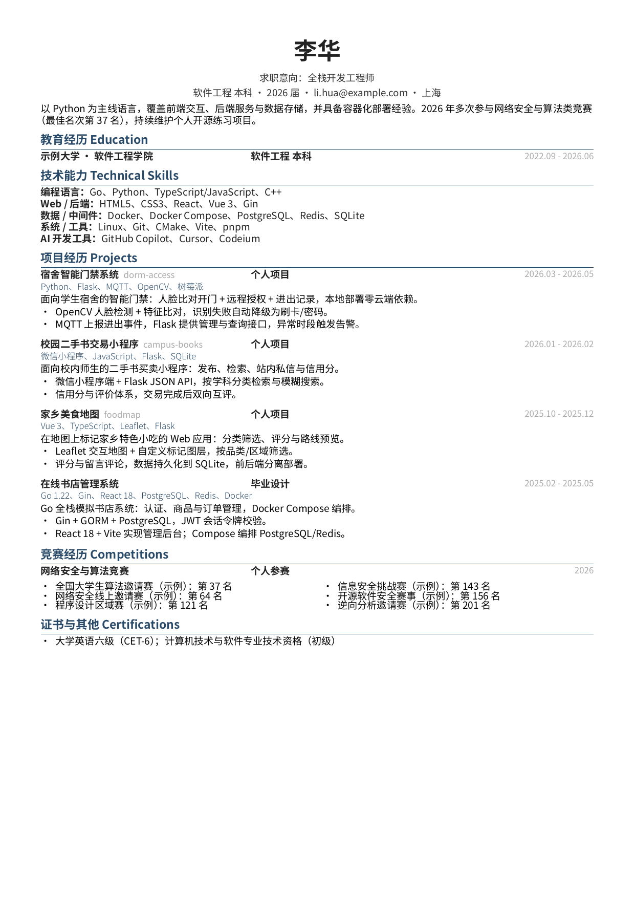

# resume-typst-kit

技术简历 Typst 工作流工具包：可复用的「简历制作技能 + 模板 harness + 虚构示例简历 + 构建/校验脚本」。

定位：把一套经过实测的简历生产流程开源出来——基于 OrangeX4 `simple-resume` 风格的中文 Typst 模板，模板与内容分离，编译 + 渲染 + 自动校验一站式完成。

## 示例效果



## 目录结构

```
resume-typst-kit/
├── LICENSE                      # GPLv3
├── README.md                    # 本文档
├── .gitignore                   # *.pdf/*.png 忽略, 演示样例例外
├── skill/                        # 简历制作技能（Hermes Agent skill 格式）
│   ├── SKILL.md                  #   技能主文档：资料发现、事实核验、写法纪律
│   ├── references/harness.md     #   harness 使用说明
│   └── scripts/
│       ├── render_resume.sh      #   typst 编译 + 每页 PNG 渲染
│       └── verify_resume.sh      #   页数/必需文本/禁止文本/嵌入字体校验
└── example/                      # 虚拟示例简历（虚构人物，勿直接投递）
    ├── template.typ              #   模板（布局/样式/组件）
    ├── resume.typ                #   示例内容：李华 · 全栈开发工程师
    └── build.sh                  #   编译 + 预览 + 校验（产物 git 忽略）
```

## 快速开始

```bash
# 依赖: typst, poppler-utils (pdftoppm/pdfinfo/pdftotext/pdffonts), Noto Sans CJK SC 字体
cd example
./build.sh
```

产物：`resume.pdf`（一页）+ `resume-preview.png`（首页预览）。build.sh 会调用
`skill/scripts/verify_resume.sh` 自动校验：默认要求出现「李华 / 上海 / 邮箱 / 竞赛经历 / 项目经历」，
默认禁止出现 `secret-team-alias` / `secret-account-alias`（占位私密标识，换成自己的）。

注意：渲染产物被 .gitignore 忽略（typst 在 PDF 内嵌创建时间戳，每次构建二进制都不同），
build.sh 可反复执行且 git status 保持干净。

## 用自己的信息新建简历

1. 拷贝模板 + 内容文件到工作目录：
   ```bash
   mkdir -p ~/my-resume && cd ~/my-resume
   cp ../resume-typst-kit/example/template.typ .
   cp ../resume-typst-kit/example/resume.typ .
   ```
2. 编辑 `resume.typ`：替换姓名/城市/邮箱/学校/项目/赛事，项目链接换成真实仓库地址。
3. 编译并校验（可选传页数、必需文本清单、禁止文本清单，每行一个子串，空文件跳过检查）：
   ```bash
   typst compile resume.typ resume.pdf
   bash ../resume-typst-kit/skill/scripts/verify_resume.sh resume.pdf 1 required.txt forbidden.txt
   ```
4. 事实核验纪律（详见 `skill/SKILL.md`）：先核验来源再写数字；没有来源的 QPS/用户数/名次不写；
   项目 bullet 遵循「做了什么 + 用什么实现 + 产生了什么可验证结果」。

（假设 `~/my-resume` 与仓库目录同级；如路径不同，按实际位置调整上文中的相对路径。）

## 隐私与安全

- 本仓库所有示例均为虚构人物（李华）与占位链接（`example.com`），可直接 fork 使用。
- 提交公开仓库前必做自查，把以下内容替换或删除：
  - 真实姓名、城市、手机号、邮箱、QQ、身份证号
  - 本地绝对路径（如 `/home/<user>/...`）、凭据、API key、私有仓库名
  - 可关联到真实身份的账号/队伍名、比赛名次组合（名次+赛事名可能反查身份）
- `verify_resume.sh` 的 forbidden 清单就是干这个的：把上面这些字符串每行一个写进文本文件，作为第 4 个参数传入。
- 模板/技能文档不写死任何个人数据；示例中的学校、公司、赛事均为虚构占位。

## 设计与实测

- 模板与内容分离：`template.typ` 只含布局/样式/组件（`item` / `skill` / `tech` / `project`），
  内容文件 `#import "template.typ": *` 后以 `#resume-template[ ... ]` 包裹正文。
- 分页策略：内容自然流动，不强制分页；加内容须删等量内容，小节完整性优先。
- 已实测（2026-09）：typst 0.15.1 编译通过，单页输出无字体 warning；Noto Sans CJK SC
  实际使用字重全部嵌入（示例渲染实测 Regular/Bold/Light，pdffonts 无未嵌入字体）；校验脚本默认模式、自定义文件模式与缺失文本负例均通过。
- 两个已知坑（模板/内容分离时）：顶层 `#let` 组件才会被 `import *` 导入；
  颜色常量必须放顶层（组件函数引用它们，放进模板函数体内作用域找不到）。

## 属性与许可证

- `template.typ` 派生自 [OrangeX4/Chinese-Resume-in-Typst](https://github.com/OrangeX4/Chinese-Resume-in-Typst)
  的 `simple-resume.typ`，在其基础上做了模板/内容分离、组件重写与国产字体适配。
  上游仓库**无 LICENSE 文件**（默认保留所有权利）：本仓库对修改与新增部分以 GPLv3 发布，
  使用/再分发前请自行确认上游条款。
- 本仓库其余代码与文档：GPLv3，见 [LICENSE](LICENSE)。

## 相关

- [OrangeX4/Chinese-Resume-in-Typst](https://github.com/OrangeX4/Chinese-Resume-in-Typst) — 上游模板参考
- 本工具包配套的 Hermes Agent 技能说明见 `skill/SKILL.md`